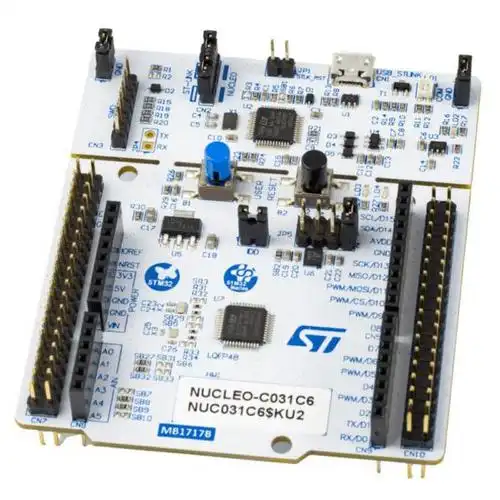
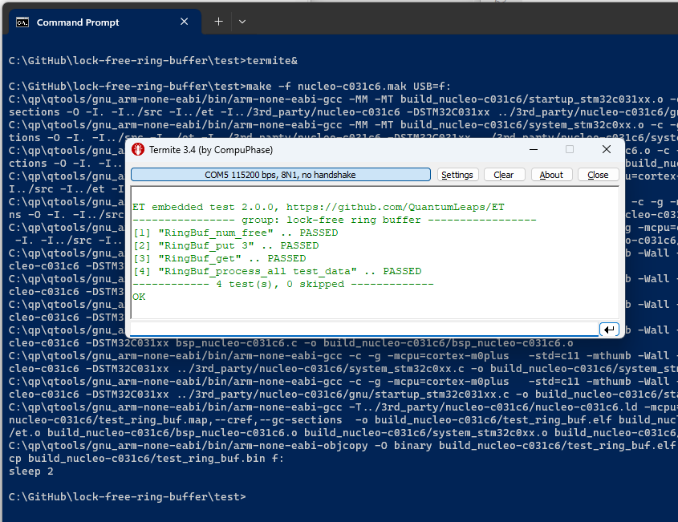

## Brought to you by:
[](https://www.state-machine.com)
<hr>

[](https://github.com/QuantumLeaps/lock-free-ring-buffer/releases/latest)
[](https://github.com/QuantumLeaps/lock-free-ring-buffer/blob/master/LICENSE)

# What is it?
"Lock-Free Ring Buffer" (LFRB) is a minimal, customizable implementation
of a ring buffer (a.k.a. circular buffer) in C, specifically suitable
for embedded systems, such as single-core microcontrollers with:
- ARM Cortex-M CPU
- MSP430 CPU
- PIC24/dsPIC CPU
- other similar 16/32-bit CPUs

> **NOTE** The presented LFRB implementation is intended for deeply embedded
systems, such as single-core ARM Cortex-M MCUs without cache memories.
The presented implementation might not be appropriate for complex multi-core
SoCs with cache memory, etc. Please refer to the literature, for example:
- [<i>Correct and Efficient Bounded FIFO Queues</i>](lit/RR-8365.pdf).
- [<i>Optimised Lock-Free FIFO Queue</i>](lit/Optimised_lock_free_FIFO_queue.pdf).

# Lock-Free Restrictions
The ring buffer does not require any "locking" (mutual exclusion
mechanism) as long as the following restrictions are met:

1. Only one thread/interrupt can produce data into the ring buffer
2. Only one thread/interrupt can consume data from the ring buffer
3. Both the producer and consumer run on the same CPU
4. The system has strong memory consistency
5. Additional assumptions about the "atomicity" of the LFRB counters
are spelled out in the [ring_buf.h](src/ring_buf.h) header file

In other words, LFRB is a **single-producer, single-consumer FIFO**.
Fortunately, this is the most frequently encountered scenario in deeply
embedded applications.

# Code Structure
The ring buffer implementation consists of two files located in the
src directory:

- [ring_buf.h](src/ring_buf.h)  - contains the interface
- [ring_buf.c](src/ring_buf.c)  - contains the implementation

The ring buffer holds elements of they type RingBufElement, which
can be customized (typically `uint8_t`, `uint16_t`, `uint32_t`, `float`,
`void*` (pointers), etc.)


# Test/Example of Use
The directory `ET` contains the
[<b>Embedded Test (ET)</b>](https://github.com/QuantumLeaps/Embedded-Test)
super-simple testing framework. ET is used to test the LFRB.

<p align="center">
<a title="ET on GitHub" href="https://github.com/QuantumLeaps/Embedded-Test"></a>
</p>

Specifically, the ET tests and examples of use of LFRB are located in the file:

- [test/test_ring_buf.c](test/test_ring_buf.c) - example of use and tests the LFRB.

## Testing on the Host
To build and run the tests on the host, open a terminal, change to the `test`
sub-directory and type `make`. The generated output is shown below:

```
make
gcc -MM -MT build_host/et_host.o -c -g -O -fno-pie -std=c11 -pedantic -Wall -Wextra -W -I. -I../src -I../et  -DQ_HOST ../et/et_host.c > build_host/et_host.d
gcc -MM -MT build_host/et.o -c -g -O -fno-pie -std=c11 -pedantic -Wall -Wextra -W -I. -I../src -I../et  -DQ_HOST ../et/et.c > build_host/et.d
gcc -MM -MT build_host/test_ring_buf.o -c -g -O -fno-pie -std=c11 -pedantic -Wall -Wextra -W -I. -I../src -I../et  -DQ_HOST test_ring_buf.c > build_host/test_ring_buf.d
gcc -MM -MT build_host/ring_buf.o -c -g -O -fno-pie -std=c11 -pedantic -Wall -Wextra -W -I. -I../src -I../et  -DQ_HOST ../src/ring_buf.c > build_host/ring_buf.d
gcc -c -g -O -fno-pie -std=c11 -pedantic -Wall -Wextra -W -I. -I../src -I../et  -DQ_HOST ../src/ring_buf.c -o build_host/ring_buf.o
gcc -c -g -O -fno-pie -std=c11 -pedantic -Wall -Wextra -W -I. -I../src -I../et  -DQ_HOST test_ring_buf.c -o build_host/test_ring_buf.o
gcc -c -g -O -fno-pie -std=c11 -pedantic -Wall -Wextra -W -I. -I../src -I../et  -DQ_HOST ../et/et.c -o build_host/et.o
gcc -c -g -O -fno-pie -std=c11 -pedantic -Wall -Wextra -W -I. -I../src -I../et  -DQ_HOST ../et/et_host.c -o build_host/et_host.o
gcc     -no-pie  -o build_host/test_ring_buf.exe build_host/ring_buf.o build_host/test_ring_buf.o build_host/et.o build_host/et_host.o
build_host/test_ring_buf.exe

ET embedded test 2.0.0, https://github.com/QuantumLeaps/ET
---------------- group: lock-free ring buffer -----------------
[1] "RingBuf_num_free" .. PASSED
[2] "RingBuf_put 3" .. PASSED
[3] "RingBuf_get" .. PASSED
[4] "RingBuf_process_all test_data" .. PASSED
------------ 4 test(s), 0 skipped -------------
OK
```

## Testing on STM32 NUCLEO-C031C6
The LFRB distribution provides a simple makefile (see [test/nucleo-c031c6.mak)) to build the tests for the STM32 NUCLEO-C031C6 shown below.

<p align="center"></p>

> **REMARK**<br>
The STM32 NUCLEO board has been selected because it can to be programmed by simply copying the binary image to the board enumerated as a USB drive.

The LFRB distribution contains all files requried to build the binary image for the NUCLEO-C031C6 board. However, you still need to provide the GCC-ARM compiler and the serial terminal utility to receive the output produced by the board. To run the test on the STM32 NUCLEO-C031C6, you open a terminal window and type:

```
cd lock-free-ring-buffer/test

make -f make_nucleo-c031c6 USB=g:
```

> **NOTE**<br>
The GCC-ARM cross-compiler for Windows as well as the `make` utility are available in the [QTools collection](https://github.com/QuantumLeaps/qtools) for Windows.

The follwing screen shot shows the build process, programming the board (by copying the binary image) and the test output on the [Termite serial terminal](https://www.compuphase.com/software_termite.htm).

<p align="center"></p>


# Licensing
The LFRB is [licensed](LICENSE) under the MIT open source license.


# Comments/Discussion
If you'd like to discuss LFRB or related subjects, plese use the
["Issues" tab](https://github.com/QuantumLeaps/lock-free-ring-buffer/issues).

# How to Help this Project?
Please feel free to clone, fork, and make pull requests to improve LFRB.
If you like this project, please give it a star
(in the upper-right corner of your browser window):

<p align="center"></p>
